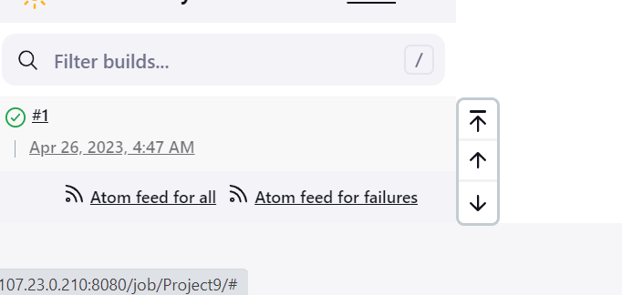
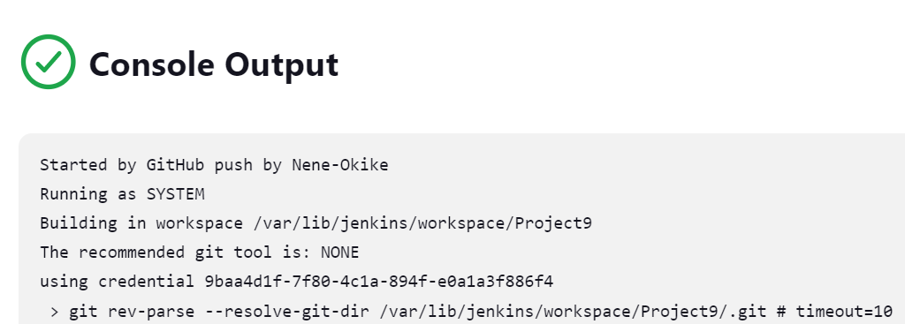
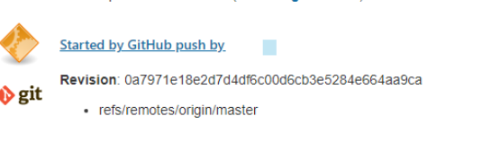
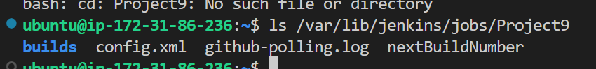
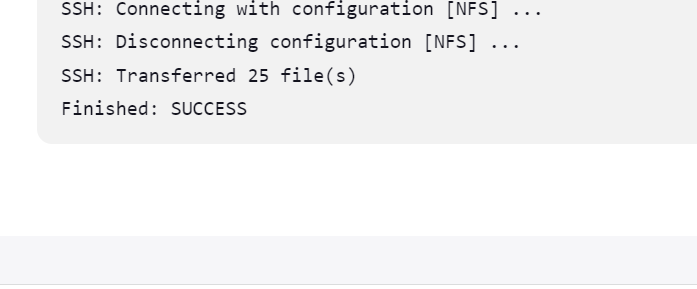
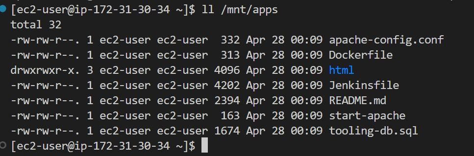

TOOLING WEBSITE DEPLOYMENT AUTOMATION WITH CONTINUOUS INTEGRATION. INTRODUCTION TO JENKINS

Step 1 – Install Jenkins server

1. Create an Ubuntu server in AWS
2.  Install JDK with these commands.

sudo apt update

sudo apt install default-jdk-headless

3. Install Jenkins

wget -q -O - https://pkg.jenkins.io/debian-stable/jenkins.io.key | sudo apt-key add -
sudo sh -c 'echo deb https://pkg.jenkins.io/debian-stable binary/ > \
    /etc/apt/sources.list.d/jenkins.list'
sudo apt update
sudo apt-get install jenkins

Make sure jenkins is running with this command

sudo systemctl enable jenkins
sudo systemctl status jenkins

4. Edit inbound rules in jenkins server secuirty group to open TCP 8080

5. Perform initial jenkins set up

from your browser access the jenkins with this

From your browser access http://3.93.179.145:8080

You will be prompted to provide a default admin password

Retrieve it from your server by running this command

sudo cat /var/lib/jenkins/secrets/initialAdminPassword

Then click on the tab with install suggessted plugins

Then create an admin user and save the password.

Step 2 – Configure Jenkins to retrieve source codes from GitHub using Webhooks

We will configurea jenkins job that will be triggered using the webhook

1. Enable webhooks in your GitHub repository settings

Click on the project settings and then on webhook on the left hand tab.

Then click on Add webhook

Copy the Payload URL from jenkins and paste

Select content type as "application/json"

For this project we are only interested in "just the push event"

Click "Add webhook" to complete

2. Go to Jenkins web console, click "New Item" and create a "Freestyle project

 connect your GitHub repository by  providing its URL,https://github.com/Nene-Okike/tooling.git

  Click on the repository and copy the URl of the repository.

 Save the configuration and click on build now

 

 and the console out put

 

Configure the project with webhook
1. click on "configure" you job/projects and add these two configurations
under Build Triggers check the box for GitHub hook trigger for GITScm polling

2. Configure "Post-build Actions" to archive all the files or artifacts.

Save the configurations.

Make some changes on the readme.md file in the repository and commit the changes. 
The next buid starts and shows this

By default, the artifacts are stored on Jenkins server locally

Run this command `ls /var/lib/jenkins/jobs/tooling_github/builds/<build_number>/archive/`
to show the artifacts on the server

Step 3 – Configure Jenkins to copy files to NFS server via SSH

1. Install "Publish Over SSH" plugin.

On main dashboard select "Manage Jenkins" and choose "Manage Plugins" menu item.

On "Available" tab search for "Publish Over SSH" plugin and install it

2. Configure the job/project to copy artifacts over to NFS server.

On main dashboard select "Manage Jenkins" and choose "Configure System" menu item.

Scroll down to Publish over SSH plugin configuration section and configure it to be able to connect to your NFS server:

1. Provide a private key (content of .pem file that you use to connect to NFS server via SSH/Putty)

2. Arbitrary name

3. Hostname – can be private IP address of your NFS server

4. Username – ec2-user (since NFS server is based on EC2 with RHEL 8)

5. Remote directory – /mnt/apps since our Web Servers use it as a mointing point to retrieve files from the NFS server

Test the configuration and make sure the connection returns Success. 

Open TCP port 22 on NFS server open to receive SSH connections.

Save your configurations.

 Open your Jenkins job/project configuration page and add "Post-build Action"; This time "send build configurations over SSH'

 Configure it to send all files probuced by the build into our previously define remote directory.  We use ** to send all files and directories.

 Save the configurations.

 Make changes to readme. md files and commit the changes.

 Webhook will trigger another build and this will be the output

 

 To confirm that the files were successfully transferred run `cat /mnt/apps/README.md`

 

